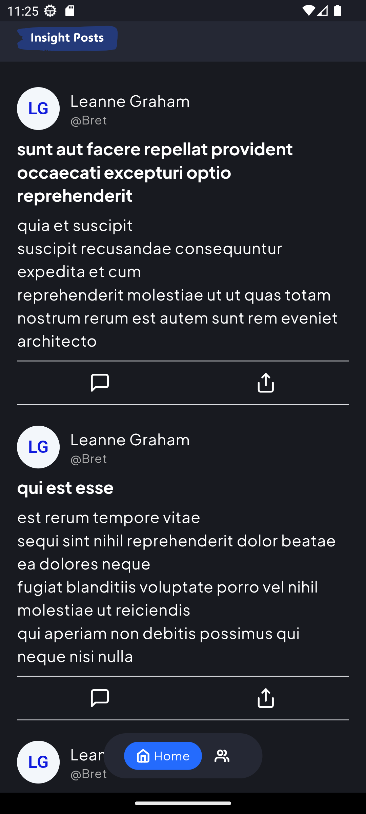
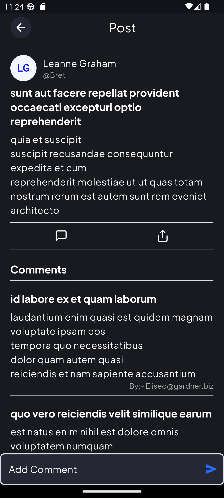
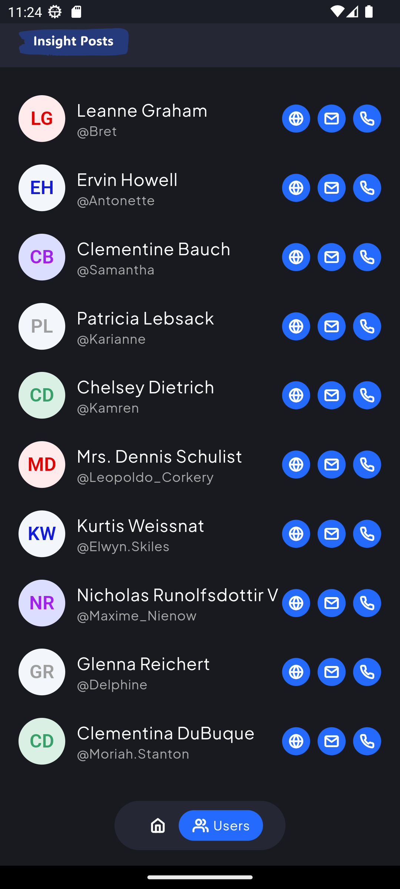

# Insight Post

**Insight Post** is a Flutter application designed to showcase various features including posts, comments, and more. The app integrates various modern Flutter libraries and is built with a focus on performance and user experience.

## Features 
- **Posts**: View detailed posts.
- **Comments**: Add and view comments on posts.
-  **Offline Support**: Use `sqflite` for local database management.
-  **Network Handling**: Fetch data with `dio` and handle connectivity issues.
-  **Responsive Design**: Built with `flutter_screenutil` for different screen sizes.
- **State Management**: Managed with `flutter_riverpod` for efficient state handling.
- **Navigation**: Utilizes `go_router` for routing and navigation.

## Getting Started
To get started with this project, follow these steps:
1. **Clone the Repository**
	```bash 
	git clone https://github.com/satish-nep79/insight_post
	cd insight_post
	```
2.  **Install Dependencies**
		Make sure you have Flutter installed. Run the following command to install the dependencies:
	```bash 
	flutter pub get
	```
3.  **Run the App**
	You can run the app on an emulator or a physical device:
	```bash 
	flutter run
	```

## Project Structure
```bash
lib/
|- common
| |- constants
| |- controllers
| |- models
| |- route
| |- widgets
|- features
| |- feature1
| | |- controller
| | |- models
| | |- views
| | | |- widgets
|- repo
|- services
|- utils
| - main.dart
```

## Dependencies
- `flutter_riverpod`: State management.
-   `dio`: Networking.
-   `cached_network_image`: Image caching.
-   `sqflite`: SQLite database.
-   `path`: File path utilities.
-   `flutter_screenutil`: Responsive design.
-   `go_router`: Navigation and routing.
-   `flutter_svg`: SVG support.
-   `shared_preferences`: Local storage.
-   `url_launcher`: Launch URLs.
-   `skeletonizer`: Skeleton loading animations.
-   `share_plus`: Sharing content.
-   `connectivity_plus`: Connectivity checks

## Development 
To contribute to this project, please ensure you follow these guidelines:

-   **Code Style**: Follow the Dart and Flutter code style guidelines.
-   **Testing**: Write tests for new features or bug fixes.
-   **Pull Requests**: Submit pull requests with clear descriptions and reference any relevant issues.


## Screenshots

 </br>
 


## Contact

For any questions or issues, please contact:

-   **Name**: Satish Nepali
-   **Email**: satishnepali79@gmail.com

